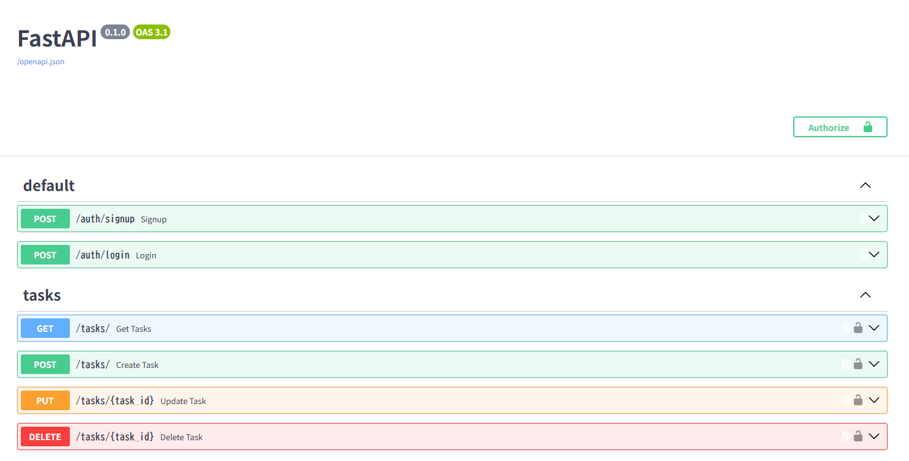
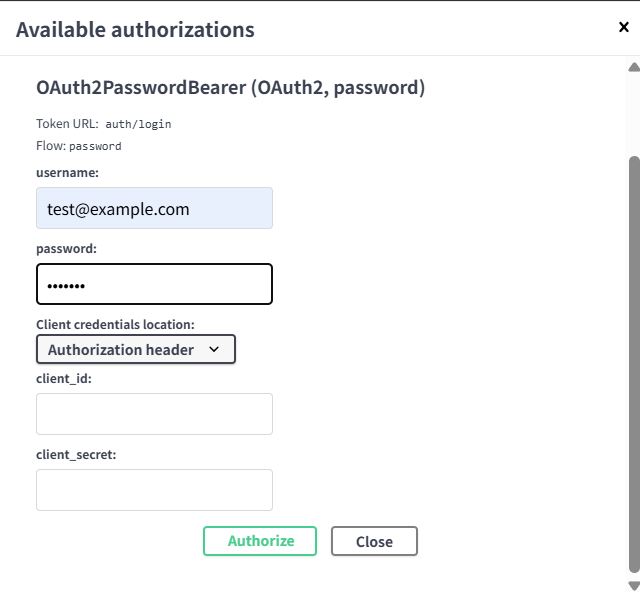
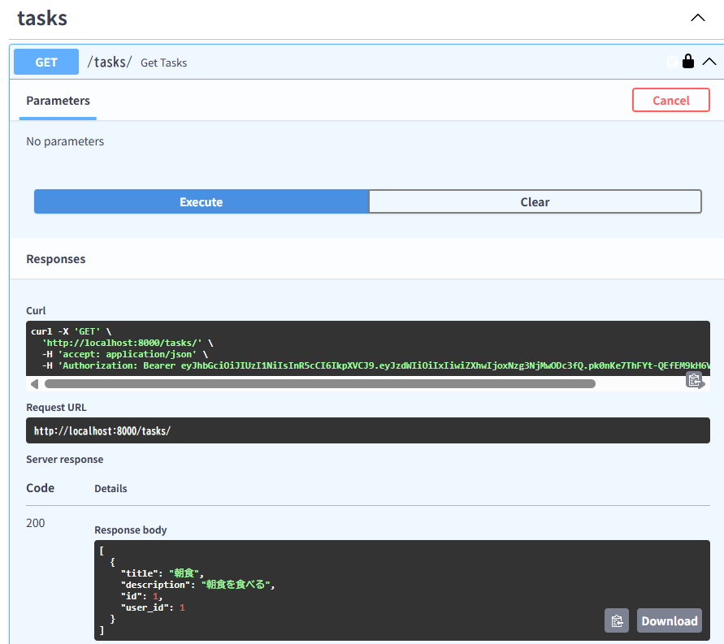
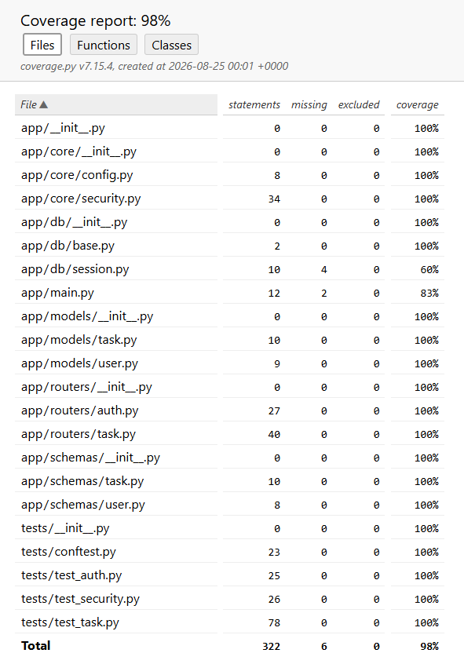

＜プロジェクト概要＞  
FastAPIを使った認証付きタスク管理APIです。
JWT認証、CRUD、例外処理、pytestによるテスト、Dockerによる環境構築を備えています。

## Swagger UI


## Authorizeボタン


## 認証後のタスク一覧


＜使用技術＞
- FastAPI
- Python
- SQLAlchemy
- JWT (python-jose)
- Poetry(依存管理)
- Docker/ Docker Compose
- PostgreSQL(本番環境)
- pytest
- coverage
- SQLite(テスト環境)
※ テストでは高速化のため SQLite（:memory:）を使用しています。
※ 本番環境では PostgreSQL を使用しています。

＜機能一覧＞
- ユーザ登録(signup)
- ログイン(JWT発行)
- タスクのCRUD
- 自分のタスクのみ操作可能
- 認証エラー（Invalid token / Expired token / User not found）

＜APIエンドポイント一覧＞
```
POST /auth/signup
POST /auth/login
GET /tasks/
POST /tasks/
PUT /tasks/{task_id}
DELETE /tasks/{task_id}
```

＜テストについて＞  
pytestによるテストを実装しています。
- 認証の正常系、異常系
- タスクCRUDの正常系、異常系
    - 404(存在しないタスク)
    - 403(他人のタスク)
- 例外処理を全て網羅
- coverageによるカバレッジ計測

＜Coverageの確認方法＞  
CoverageのHTMLレポートは以下から生成できます。
    poetry run coverage html
生成された 'htmlcov/index.html' をブラウザで開くと、  
各ファイルのカバレッジを視覚的に確認できます。  
※coverageは100% ではありませんが、テスト価値の低い箇所は意図的に除外しています。必要なロジックは十分にカバーされています。

## Coverage計測結果


＜Dockerでの起動方法＞  
docker compose up --build

＜ディレクトリ構成＞  
app/
  ├── main.py       # FastAPI アプリケーションのエントリポイント
  ├── routers/      # 認証・タスクのルーター
  ├── models/       # SQLAlchemy モデル
  ├── schemas/      # Pydantic スキーマ
  ├── core/         # 設定・セキュリティ(JWTなど)
  ├── db/           # DB セッション・初期化
tests/
  ├── test_auth.py
  ├── test_task.py
  ├── test_security.py
Dockerfile
docker-compose.yml
pyproject.toml
README.md

＜Swagger UI の操作方法＞
1. アプリを起動
    docker compose up --build
2. ブラウザでswagger UI を開く
    http://localhost:8000/docs
3. ユーザ認証
    -「POST /auth/signup」でユーザ登録
    -「POST /auth/login」でログイン情報を作成
    - 右上の「Authorize」ボタンを押下、以下の内容を入力する
        username：　登録したemail
        password：　登録したpassword
      ※ OAuth2 Password Flow により、自動的に JWT がセットされます
4. 認証後、タスクのCRUD操作が可能になる
    - GET /tasks/               # タスクの確認
    - POST /tasks/              # タスクの追加
    - PUT /tasks/{task_id}      # タスクの変更
    - DELETE /tasks/{task_id}   # タスクの削除

＜今後の拡張予定＞
- Alembic によるマイグレーション
- Refresh Token の導入
- Nginx + Gunicorn による本番構成
